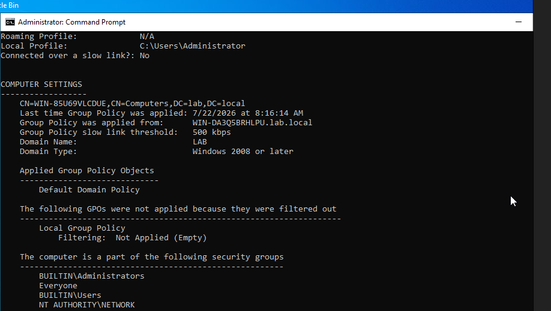
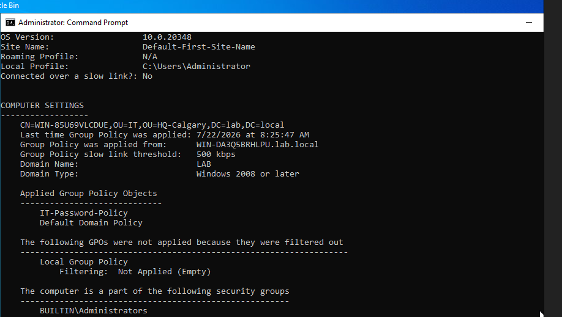
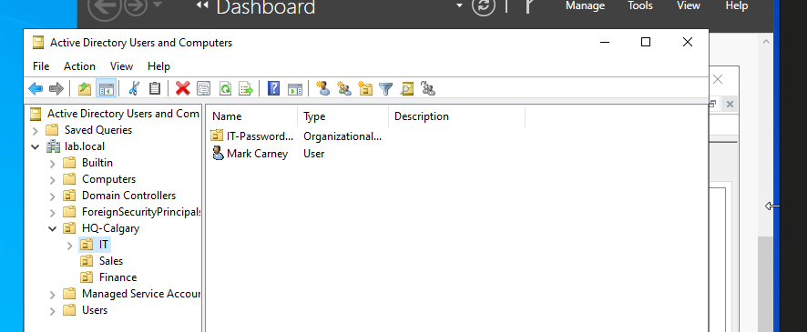
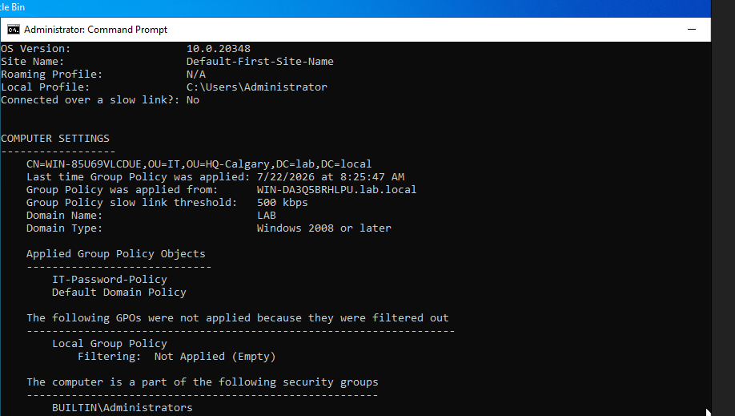
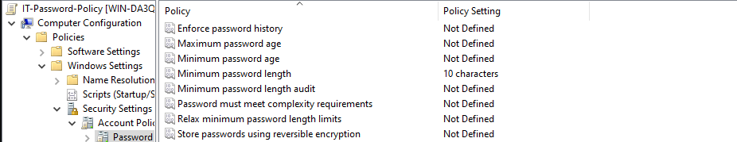
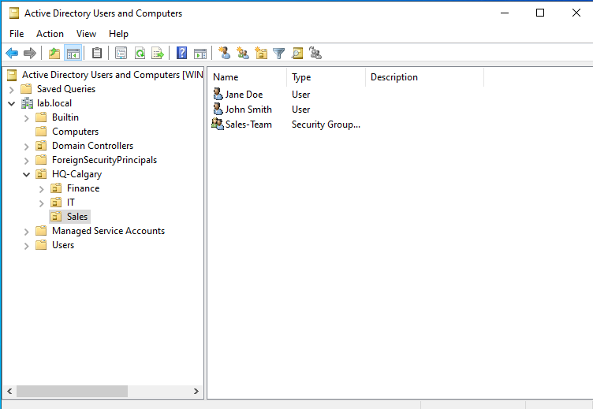
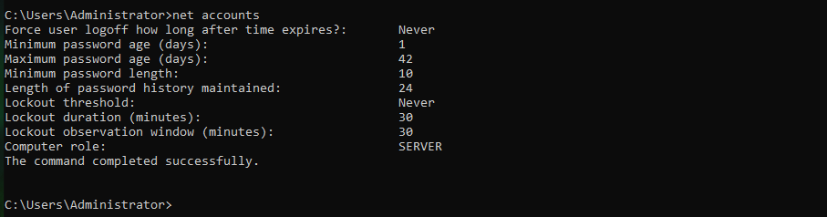
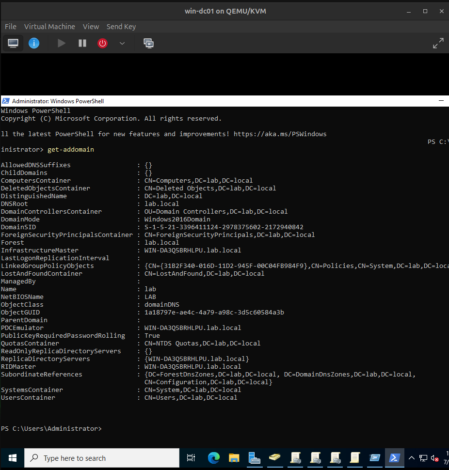
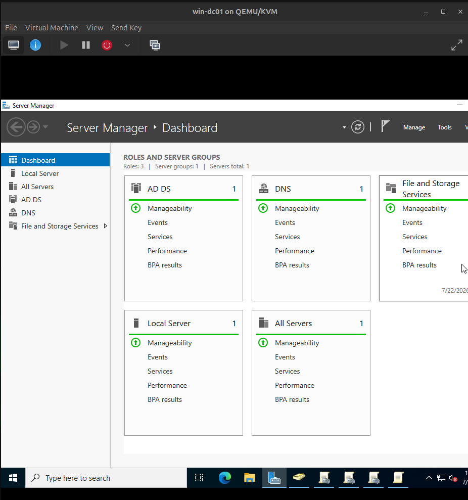

# Active Directory Lab

A self-hosted Active Directory environment built on a KVM/GNS3 lab host, extending the [hybrid-physical-virtual-lab](https://github.com/edmund-igweonu/hybrid-physical-virtual-lab) network with Windows Server directory services, Group Policy, and a domain-joined client.

## Overview

Deployed Active Directory Domain Services on Windows Server 2022, designed an OU structure and security groups for a fictional organization, created and scoped a Group Policy Object enforcing password requirements, and validated end-to-end policy application against a domain-joined Windows 11 client.

## Environment

| Component | Detail |
|---|---|
| Hypervisor | KVM/QEMU on bare-metal Ubuntu 24.04 (Acer Aspire A515-54) |
| Domain Controller | Windows Server 2022 Standard (Desktop Experience), static IP `192.168.122.50` |
| Client | Windows 11 Pro, domain-joined |
| Network | KVM `default` NAT network, `192.168.122.0/24` |
| Domain | `lab.local` |

## Build Steps

1. **Provisioned the DC VM** — Windows Server 2022 on KVM, set a static IP with DNS pointed at itself (`127.0.0.1`) ahead of promotion.
2. **Installed AD DS and DNS**, then promoted the server to a new forest/domain (`lab.local`).
3. **Designed an OU structure** reflecting a small organization:
   ```
   lab.local
   └── HQ-Calgary
       ├── IT
       ├── Sales
       └── Finance
   ```
4. **Created user accounts and a security group** (`Sales-Team`) scoped to the Sales OU.
5. **Created and scoped a GPO** (`IT-Password-Policy`) linked to the IT OU, enforcing a 10-character minimum password length.
6. **Joined a Windows 11 client** to the domain, pointing its DNS at the DC beforehand so domain resolution would work.
7. **Verified policy application** with `gpresult /r` and `net accounts` — and diagnosed a real scoping issue along the way (below).

## Troubleshooting: GPO Not Applying

The first `gpresult /r` on the client showed only the **Default Domain Policy** applied — `IT-Password-Policy` wasn't listed under applied *or* filtered-out GPOs, meaning it was never in scope for that computer object at all.

**Diagnosis:** the client's computer account had landed in the default `CN=Computers` container on domain join, rather than the `IT` OU. Since `IT-Password-Policy` is linked to the `IT` OU, it never had a reason to apply.

**Fix:** moved the computer object in ADUC from `Computers` into `OU=IT,OU=HQ-Calgary`, then re-ran `gpupdate /force` on the client.

Confirmed via `gpresult /r`:



Computer object path after the fix: `CN=<client>,OU=IT,OU=HQ-Calgary,DC=lab,DC=local`

## Verification

`net accounts` on the client confirms the enforced minimum password length of 10 characters, matching the GPO setting:



## Screenshots

**AD DS and DNS roles installed**


**Domain and forest created**


**OU structure**


**Users and security group**


**GPO configuration**


**GPO linked to the IT OU**


**Client domain-joined**


## What This Demonstrates

- Standing up AD DS, DNS, and a new forest/domain from scratch
- Designing an OU hierarchy and security groups around an organizational structure
- Authoring and correctly scoping a GPO, including diagnosing a real scope/inheritance issue via `gpresult`
- Verifying policy enforcement from both the administrative side (GPMC) and the client side (`net accounts`)
